<h1>
  <p align=center>
  Pneumonia Detector :lungs:
  </p>
  </h1>

</br>


[](https://github.com/BIA4-course/2022-23-Group-06)
[](https://github.com/BIA4-course/2022-23-Group-06)
[](https://github.com/BIA4-course/2022-23-Group-06)
[](https://github.com/BIA4-course/2022-23-Group-06)
[](https://github.com/BIA4-course/2022-23-Group-06)

---
## Demo video
Please click the following image to jump to YouTube to watch the video.

<p align="center">
  <a href ="https://youtu.be/q6kwzmrTaZc">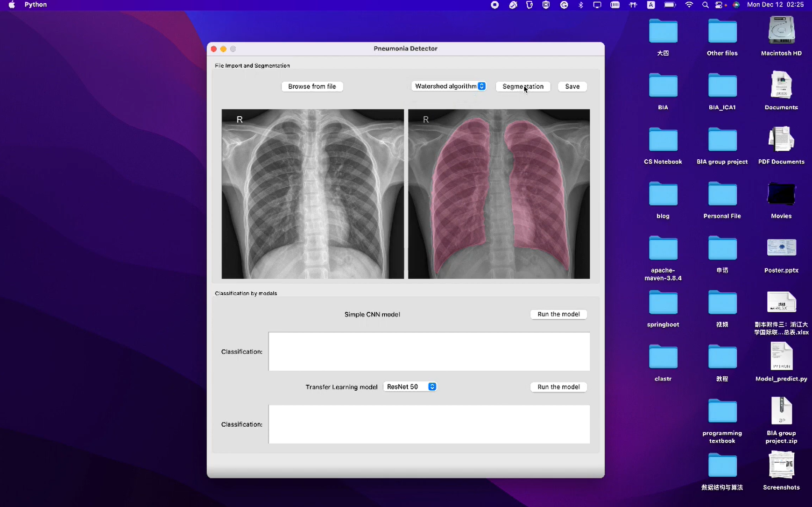</a>
  </p>

---
<!-- TABLE OF CONTENTS -->
<h2 id="table-of-contents"> Table of Contents</h2>

<details open="open">
  <summary>Table of Contents</summary>
  <ol>
    <li><a href="#Background"> ➤ Background</a></li>
    <li><a href="#Installation"> ➤ Installation</a></li>
    <li><a href="#Usage"> ➤ Usage</a></li>
    <li><a href="#Acknowledgments"> ➤ Acknowledgments</a></li>
    <li><a href="#References"> ➤ References</a></li>
    <li><a href="#License"> ➤ License</a></li>
  </ol>
</details>

---
<h2 id="Background"> Background</h2>


### Pneumonia

Pneumonia is an acute respiratory infection that is characterized by filled pus and fluid in the alveoli, limiting the intake of oxygen and making breathing painful. According to 2019 Global Burden of Diseases (GBD) study, 2.5 million people died from pneumonia (GBD 2019 Diseases and Injuries Collaborators, 2020). Among them, children younger than 5 years of age and adults older than 70 years of age are the most affected by pneumonia (Torres et al., 2021).

Bacterial and viral infections are the leading causes of pneumonia. It is vital to identify a specific causative pathogen since inappropriate and delayed antimicrobial treatment may lead to a bad therapeutic effect. In the clinic, regardless of the microbial etiology, patients with bacterial and viral pneumonia have similar symptoms such as cough and breathlessness. Thus, a chest radiograph (x-ray) is obtained to diagnose pneumonia, which helps to differentiate between different types of pneumonia and serves as a standard of care. The following figure illustrates x-ray images of normal and pneumonic lungs. Compared to normal lungs (left panel), bacterial pneumonia (middle panel) shows a focal lobar consolidation (white arrows) while viral pneumonia (right panel) exhibits a more diffuse pattern (Kermany et al., 2018). 

<p align="center">
  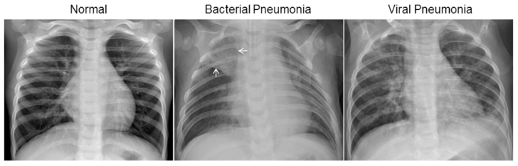
  </p>


Because of high requirements on the theory and experience of medical staff, diagnosis errors may occur, and the classification efficiency is low. Moreover, rapid image interpretation is insufficient in low-resource settings, because of which the incidence and mortality are high in those areas. Constructing an accurate and efficient system may improve diagnosis efficiency and save medical resources. Therefore, we constructed deep learning models for the diagnosis and classification of pneumonia. 


### Models and algorithms for segmentation and classification

#### U-Net model for segmentation

According to [U-Net: Convolutional Networks for Biomedical Image Segmentation](https://arxiv.org/pdf/1505.04597.pdf), U-Net is a deep-learning model that is commonly used for medical image segmentation. In the context of pneumonia, U-Net can be used to automatically classify and segment lung infections in chest X-rays or CT scans. This can be useful for automatically identifying areas of the lung that are affected by pneumonia, which can aid doctors in making a diagnosis and planning treatment.

The U-Net model was developed by Olaf Ronneberger et al. at the University of Freiburg, and it is based on the idea of an encoder-decoder network. The encoder part of the network learns to extract high-level features from the input image, while the decoder part uses these features to generate a segmentation mask that highlights the objects of interest in the image (Ali, Irtaza and Maqsood, 2022). In the case of pneumonia classification and segmentation, the U-Net model would be trained on a large dataset of X-ray or CT images of lungs, along with corresponding labels that indicate the presence and location of pneumonia. The model would then be able to automatically classify new images as containing pneumonia or not, and generate a segmentation mask that highlights the infected areas of the lung.

Overall, the use of U-Net for pneumonia classification and segmentation can help automate the process of identifying and locating lung infections, which can aid doctors in making more accurate and efficient diagnoses.

The U-net architecture is similar to the image below: 

<p align="center">
  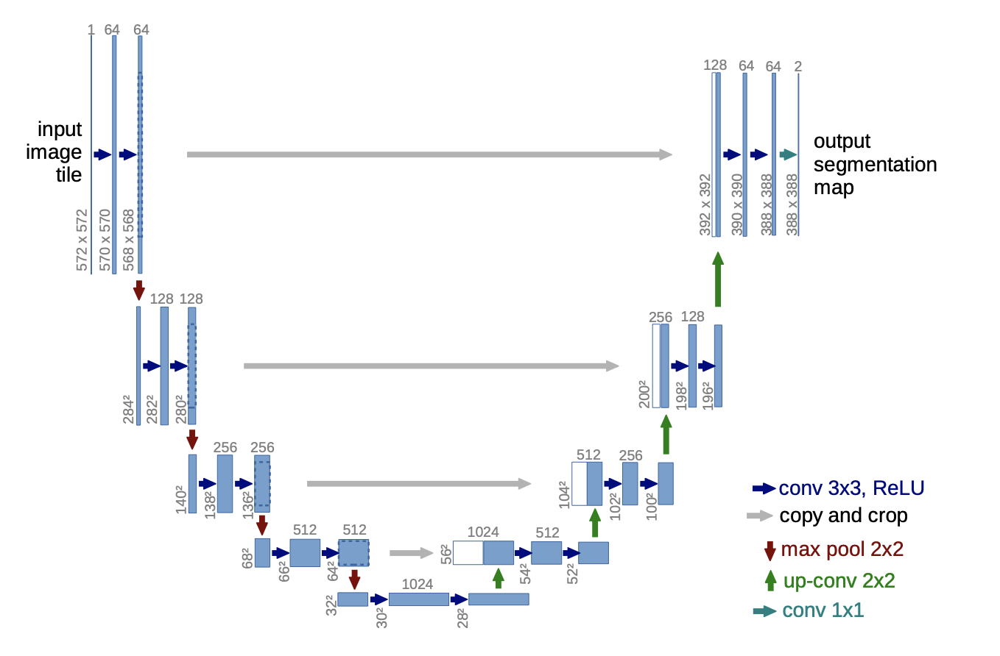
 </p>

#### Watershed Algorithm

The watershed algorithm is a type of image segmentation algorithm that can be used to identify and classify different regions in an image. The image is treated by the watershed transformation like a topographic map, with the brightness of each point representing its height, and finds the lines that run along the tops of ridges (Cao et al., 2019). In the context of pneumonia diagnosis, the watershed algorithm can be used to segment the lungs in an X-ray image, and then classify each segment as normal or abnormal (indicative of pneumonia). In this project,  we hope that this algorithm can help doctors more easily identify areas of the lungs that may be affected by pneumonia.


#### CNN model for classification

Convolutional neural networks (CNNs) are a type of deep learning algorithm that has been used in various medical image analysis tasks. They are neural networks making feature extraction over an image before classifying it (Anthimopoulos et al., 2016). The feature extraction performed consists of three basic operations below:

- Convolutional layer: filter an image for a particular feature 
- ReLU activation layer: detect that feature within the filtered image on each destination pixel
- Max pooling layer: condense the image to enhance the features

The schematic diagram of CNN architecture:

<p align="center">
  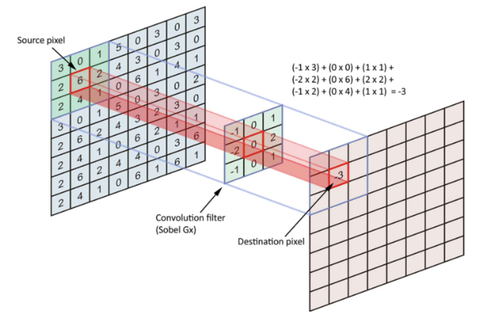
  </p>


#### Transfer Learning model

Transfer learning is a machine learning technique in which a model trained on one task is re-purposed on a second related task. It is commonly used in computer vision tasks, such as image classification and segmentation. In the context of pneumonia segmentation and classification, transfer learning could be used to improve the performance of a model by leveraging the knowledge gained from a pre-trained model that has already been trained on a large dataset.

Transfer learning can be especially useful in situations where there is limited data available for training a model from scratch. By using a pre-trained model as the starting point, the model can be trained more efficiently and with better performance than if it were trained from scratch on a small dataset.

Here, we use DenseNet and ResNet as our transfer learning models (He et al., 2016; Huang et al., 2018). The schematic diagram of CNN architecture: 
<p align="center">
  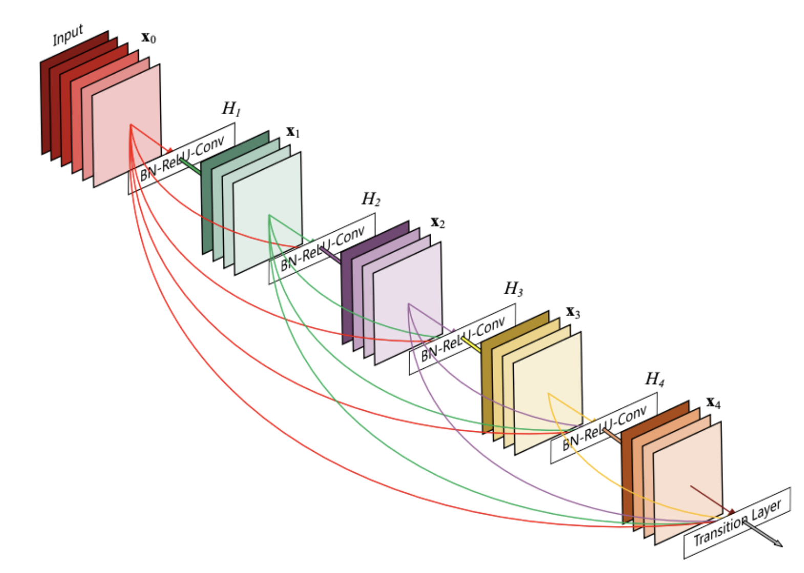
  </p>


---

<h2 id="Installation"> Installation</h2>

1. Clone the Pneumonia Detector repository

   ```shell
   git clone --recursive https://github.com/BIA4-course/2022-23-Group-06.git
   ```

2. Download the saved CNN models from GitHub releases
   - [unet.h5](https://github.com/BIA4-course/2022-23-Group-06/releases/download/trained_models/unet.h5)
   - [simple_CNN.h5](https://github.com/BIA4-course/2022-23-Group-06/releases/download/trained_models/simple_CNN.h5)
   - [ResNet50.h5](https://github.com/BIA4-course/2022-23-Group-06/releases/download/trained_models/ResNet50.h5)
   - [DenseNet121.h5](https://github.com/BIA4-course/2022-23-Group-06/releases/download/trained_models/DenseNet121.h5)

3. Copy the saved model to the trained_models directory

   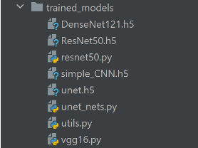
   
4. Run the following shell command to start the software
   ```shell
   python3 main.py
   ```
   
---

<h2 id="Usage"> Usage</h2>


<p align="center">
  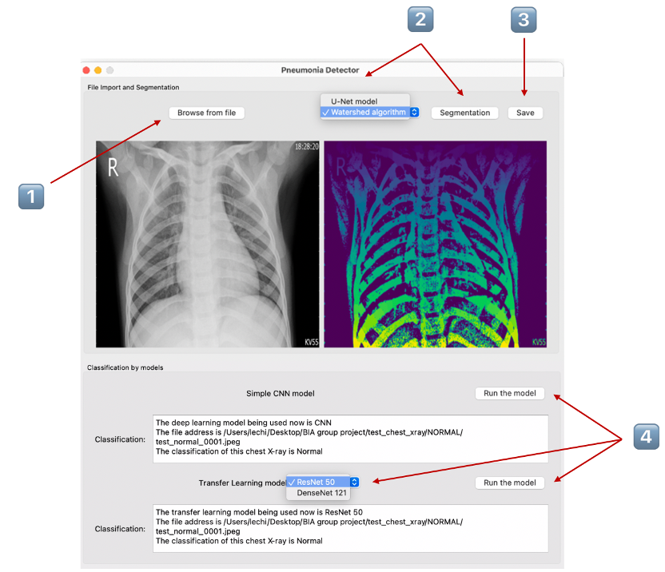
  </p>


### Step1⃣️: Input the file
By clicking the `Browse from file` button, a window will pop up, users are allowed to choose a picture in all formats (Figure 1A). Attention here, users are only allowed to input a single picture. Multiple pictures or file folders are not allowed in this version. After successfully uploaded, the selected photo will be displayed on the screen, just like the one shown in Figure 1B.

</br>


<p align="center">
  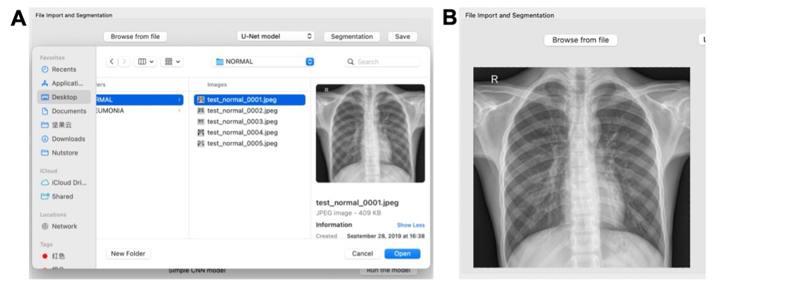
  </p>

<p align="center">
  <em>Figure 1</em>
  </p>


### **Step2⃣️: Segmentation**

In the segmentation part, two models are offered. By clicking the combo box, users can choose the model they prefer, U-Net model or Watershed algorithm. The result picture will be shown in the screen once they click the `Segmentation` button. If users click the `Segmentation` button without importing images, a window with a warning message is designed to appear (Figure 2A). 

In U-Net model, lung sections are segmented out in pink color (Figure 2B). In the Watershed algorithm, the ribs and the shadows between the lungs are clearly shown. Users can use it for auxiliary diagnosis. As shown in figure 2C, the segmented normal chest X-ray depicts a clear lung with a uniformly distributed shadow. As for bacterial pneumonia, focal lobar consolidation is an important feature that we can clearly see in the upper lobe (red arrows). Compared to normal lung and bacterial pneumonia, a more diffuse interstitial pattern can be captured in lungs with viral pneumonia.


<p align="center">
  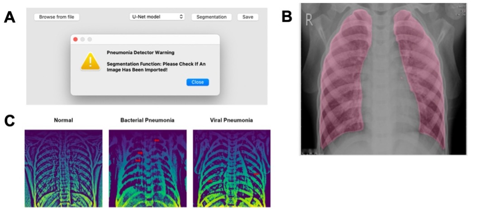
  </p>


<p align="center">
  <em>Figure 2</em>
  </p>


### **Step3⃣️: Save the segmentation result**
After previewing on the screen, if the users want to download the result picture, they can click the `Save` button and choose the save path in the pop-up box. Our software is able to save all types of image formats, from JPEG, and PNG to TIFF (Figure 3).

<p align="center">
  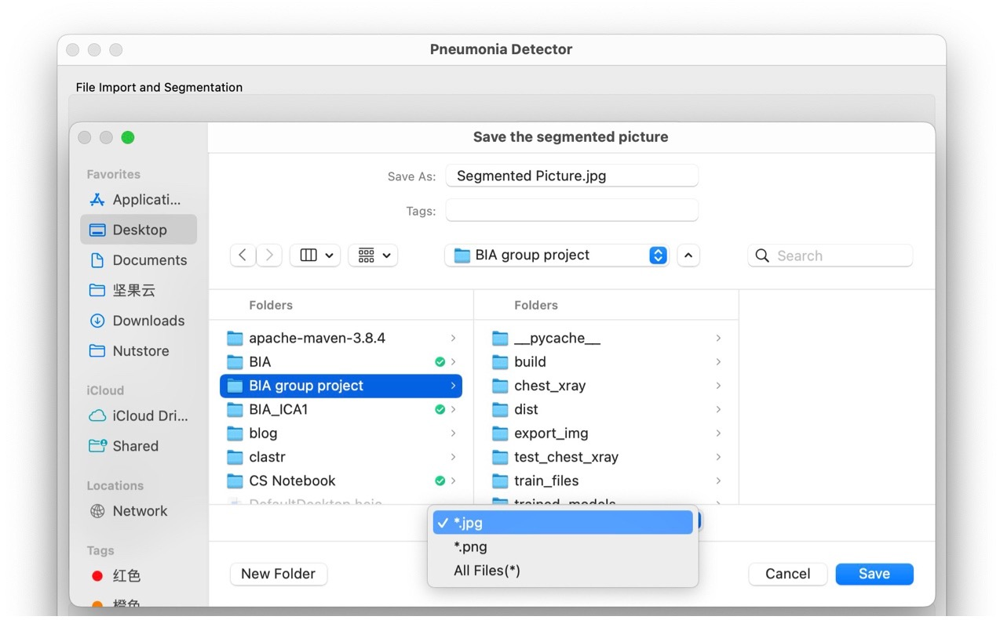
  </p>
  
<p align="center">
  <em>Figure 3</em>
  </p>


### **Step4⃣️: classification**

There are three classifiers to be chosen for pneumonia identification, including simple CNN model, transfer learning model ResNet-50 and transfer learning model DenseNet-121. Users could click the `Run the model` button in the `Simple CNN model` window to detect pneumonia by simple CNN model. As for the `Transfer Learning model` window, users need to firstly select ResNet-50 or DenseNet-121 model, and then click the `Run the model` button to apply the model for pneumonia identification. The results would be shown in the `Classification:` dialog boxes, including the choice of model type, the file address of the analyzed picture, and the result of pneumonia identification (“Normal”, “Bacteria” or “Virus”).

For instance, ResNet-50 is selected as the transfer learning model (Figure 4). After clicking `Run the model` button on the top right, the output is shown in the dialog box. The first sentence tells users that the model being used now is ResNet-50. On the next line, it shows the file address and the file name. The file name indicates that the ground truth of the result is `Normal`. The last sentence shows the classification result of this chest X-ray is `Normal`, which is consistent with the correct label.


<p align="center">
  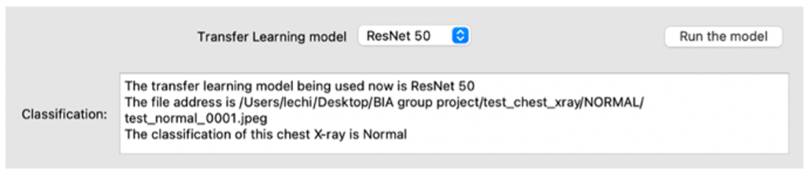
  </p>


<p align="center">
  <em>Figure 4</em>
  </p>


---

<h2 id="Acknowledgments"> Acknowledgement</h2>

We thank Dr. Nicola Romanò for his teaching in image analysis and advice on this project.

Dataset for classification task: [Chest X-Ray Images (Pneumonia)](https://www.kaggle.com/datasets/paultimothymooney/chest-xray-pneumonia).

Dataset for segmentation task: [Shenzhen Hospital X-ray Set](https://ceb.nlm.nih.gov/repositories/tuberculosis-chest-x-ray-image-data-sets/) and [Lung Masks for Shenzhen Hospital Chest X-ray Set](https://www.kaggle.com/datasets/yoctoman/shcxr-lung-mask).


---

<h2 id="References"> References</h2>
Ali, Z., Irtaza, A. and Maqsood, M. (2022) ‘An efficient U-Net framework for lung nodule detection using densely connected dilated convolutions’, The Journal of Supercomputing, 78(2), pp. 1602–1623. Available at: https://doi.org/10.1007/s11227-021-03845-x.

Anthimopoulos, M. et al. (2016) ‘Lung Pattern Classification for Interstitial Lung Diseases Using a Deep Convolutional Neural Network’, IEEE transactions on medical imaging, 35(5), pp. 1207–1216. Available at: https://doi.org/10.1109/TMI.2016.2535865.

Cao, M. et al. (2019) ‘Segmentation of immunohistochemical image of lung neuroendocrine tumor based on double layer watershed’, Multimedia Tools and Applications, 78(7), pp. 9193–9215. Available at: https://doi.org/10.1007/s11042-018-6431-5.

GBD 2019 Diseases and Injuries Collaborators (2020) ‘Global burden of 369 diseases and injuries in 204 countries and territories, 1990-2019: a systematic analysis for the Global Burden of Disease Study 2019’, *Lancet (London, England)*, 396(10258), pp. 1204–1222. Available at: https://doi.org/10.1016/S0140-6736(20)30925-9.

He, K. et al. (2016) ‘Deep Residual Learning for Image Recognition’, in 2016 IEEE Conference on Computer Vision and Pattern Recognition (CVPR). 2016 IEEE Conference on Computer Vision and Pattern Recognition (CVPR), Las Vegas, NV, USA: IEEE, pp. 770–778. Available at: https://doi.org/10.1109/CVPR.2016.90.

Huang, G. et al. (2018) ‘Densely Connected Convolutional Networks’. arXiv. Available at: http://arxiv.org/abs/1608.06993 (Accessed: 12 December 2022).

Kermany, D.S. *et al.* (2018) ‘Identifying Medical Diagnoses and Treatable Diseases by Image-Based Deep Learning’, *Cell*, 172(5), pp. 1122-1131.e9. Available at: https://doi.org/10.1016/j.cell.2018.02.010.

Torres, A. *et al.* (2021) ‘Pneumonia’, *Nature Reviews Disease Primers*, 7(1), p. 25. Available at: https://doi.org/10.1038/s41572-021-00259-0.

---

<h2 id="License"> License</h2>

The software is available under the [GNU General Public License v3.0](https://github.com/BIA4-course/2022-23-Group-06/blob/main/LICENSE).


